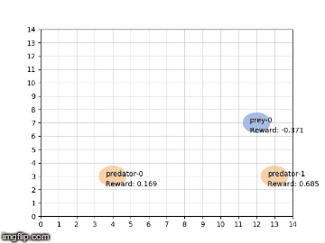
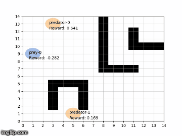
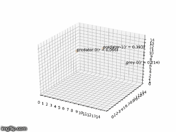

# MARL for patrolling agents

DDQN Normal 2vs1 | DDQN Obstacles 2vs1 | DDQN 3D 2vs1
:---------:|:----------:|:-----------:
 |  | 


Inspired from the idea in [Yasuyuki, S., Hirofumi, O., Tadashi, M., & Maya, H. (2015, May). Cooperative capture by multi-agent using reinforcement learning application for security patrol systems. In Control Conference (ASCC), 2015 10th Asian (pp. 1-6). IEEE](https://ieeexplore.ieee.org/document/7244682).

## Objective:
We have a board of size (`width`=100, `height`=100) where two kind of agents are evolving:
- `sim.Target` is a "bad guy"
- `sim.Officer` is a police officer trying to catch the bad guy.

We consider that the target is caught if there are 2 officers directly next to it before the end of the episode.

### Rewards
Rewards are computed two ways: "full" or "sparse", see `utils.rewards` for each implementation.

We can decide which to use with the `reward_type` parameter of `sim.Env`.

### Action space
A agent can do 9 actions:
- `none`: stay where it is,
- `top`: go up,
- `bottom`: do down,
- `left`, `right`, `top-left`, `top-right`, `bottom-right`, `bottom-left`.

It has besides a limited field of view that can be tweaked with the `sim.Agent.view_radius` parameter.
The distance uses the same movements as the agent actions.

### State space
We call observation a list of `sim.Agent` in the field of view (we consider that as long as an agent is int the field
of view, we know everything about it).

From an observation, we can get the state by using `utils.state_from_observation(agent, position, observation)` where
- `agent` is the instance of agent we want the state
- `position` is where the agent was at the time of the observation
- `observation` is as defined above.

It gives a 2D array of size (2 * `agent.view_radius` + 1, 2 * `agent.view_radius` + 1) where we have
information of the environment in the field of view of the agent:
- the agent itself is always in the center and has a value of 0.5
- if the agent cannot access a case (out of border) it has value -1
- if there is nothing interesting in the case, the value is 0
- if there is a "friend" (= agent of similar type) there is a value of 0.5
- if there is an "enemy" the value is 1.

*Ideas for future versions:*
- try with one-hot vectors instead of values -1, 0, 0.5 and 1.
- add information on where the target is originally to the officer to guide him to him.

### Replay memory
Everything happening to the agent is automatically saved it the `agent.histories` list.
We can get a batch of `state, next_state, action, reward` with the `utils.sample_batch_history(agent, batch_size)`
function. It returns a dictionary of keys:
- `states`: batch of state
- `next_states`: batch of state after the action
- `actions`: batch of actions (as a 9-dim one-hot vector)
- `rewards`: batch of obtained reward

## Target agent
The target agent is not learning anything: it chooses the direction that moves him the furthest away from the officer.
Otherwise, the target does not move.

## Life-cycle of the Environment - Agent interactions
### Environment
The main environment is the `sim.Env` class.
To add a new agent use 
```python
env = sim.Env()
env.add_agent(agent: sim.Agent)
```

### Cycle
- `states = env.reset()` returns the initial state for every agent in the environment
- `states, actions, rewards, terminal = env.step()` returns the new states, actions, rewards for every agents.

The `step` method executes the agent's methods in this order:

For every agent:
- `action = sim.Agent.draw_action(observation)` where the observation is the position of all agents in the field of view
- `sim.Agent.set_position(position_from_action)`
- `sim.Agent.add_action_to_history(action)`

When this first loop is finished, rewards are computed for avery agent and transmitted:
- `sim.Agent.set_reward(reward)`
